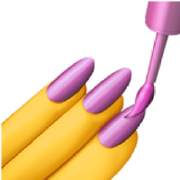
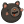

# Hi there    I'm Almaz Abdulhakov

## About me 👨‍💻

Dedicated <b>front-end developer</b> with strong knowledge of web development. Write user-friendly web interfaces, constantly practicing and learning new technologies. Have problem solving skills and can troubleshoot problems effectively. I am communicative, express myself clearly and concisely. Appreciate constructive criticism and constantly strive for personal and professional development. Ready to contribute to the team and actively develop.
 
If you would like to see projects, visit my [portfolio](https://ekzisss.github.io/)

 

## Tech Stack 🔥

	&nbsp;
	<b>Next.js</b>

&nbsp;&nbsp;&nbsp;&nbsp;&nbsp;

	&nbsp;
	<b>React</b>

&nbsp;&nbsp;&nbsp;&nbsp;&nbsp;

	&nbsp;
	<b>TypeScript</b>
 
 
 

	&nbsp;
	<b>Three.js</b>

&nbsp;&nbsp;&nbsp;&nbsp;&nbsp;

	&nbsp;
	<b>Framer Motion</b>

&nbsp;&nbsp;&nbsp;&nbsp;&nbsp;

	&nbsp;
	<b>Material UI</b>

 
 

	&nbsp;
	<b>styled-components</b>

&nbsp;&nbsp;&nbsp;&nbsp;&nbsp;

	&nbsp;
	<b>Sass</b>

 
 

	&nbsp;
	<b>Redux</b>

&nbsp;&nbsp;&nbsp;&nbsp;&nbsp;

	&nbsp;
	<b>Zustand</b>

 
 

	&nbsp;
	<b>Git</b>

&nbsp;&nbsp;&nbsp;&nbsp;&nbsp;

	&nbsp;
	<b>Docker</b>

 
 
 

## Contact 📞

	&nbsp;
	<a href="https://t.me/Ekzissss"><b>Telegram</b></a>

&nbsp;&nbsp;&nbsp;&nbsp;&nbsp;

	&nbsp;
	<a href="https://hh.ru/resume/d9aa5d3eff0be28a940039ed1f767245394a73"><b>hh.ru</b></a>

&nbsp;&nbsp;&nbsp;&nbsp;&nbsp;

	&nbsp;
	<a href="https://www.linkedin.com/in/amirsheikhmagomedov"><b>LinkedIn</b></a>
